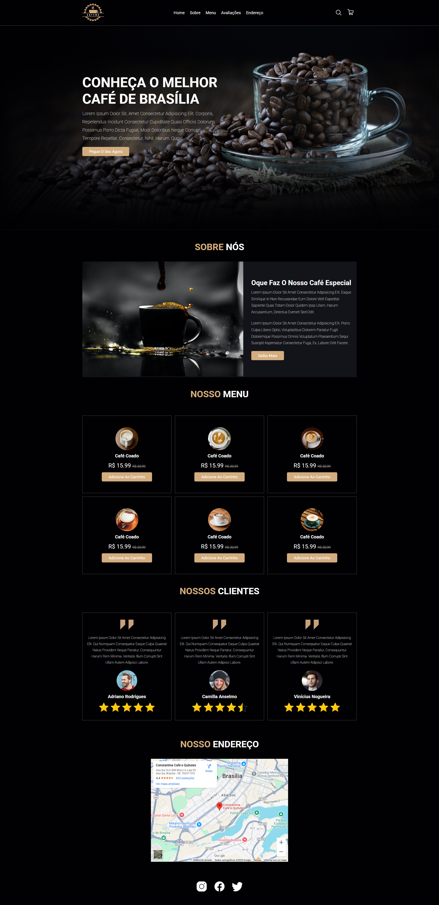

# Cafeteria - Projeto

## Descrição

Este é um projeto de uma cafeteria que foi desenvolvido para um projeto freelancer. O sistema permite aos usuários visualizar o cardápio com preços de forma interativa, além de fornecer informações sobre a loja, localização e formas de contato.

Acesse o projeto através do link: https://vinidevit.github.io/coffee/



## Tecnologias Utilizadas

- Frontend: HTML e CSS

## Funcionalidades

- **Visualizar Cardápio**: Exibe os itens disponíveis na cafeteria.
- **Informações sobre a Cafeteria**: Endereço, horário de funcionamento e outras informações relevantes.

## Como Rodar o Projeto

1. Clone o repositório para sua máquina local:
   ```bash
   git clone https://github.com/seu-usuario/nome-do-repositorio.git
